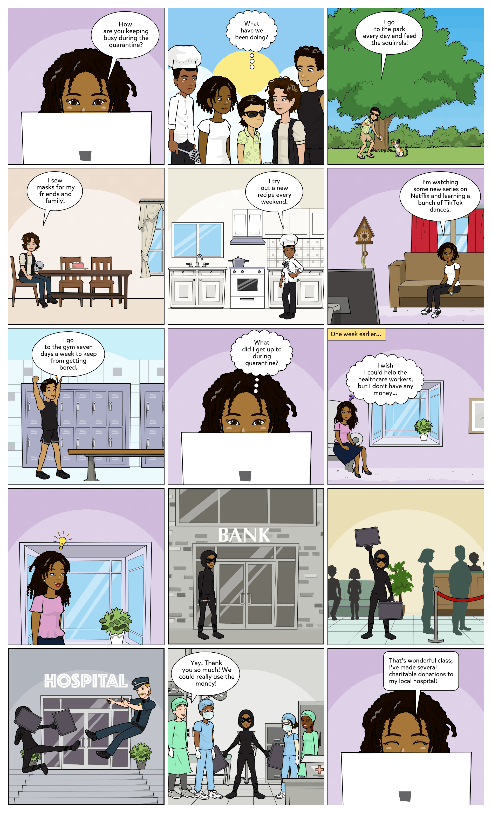
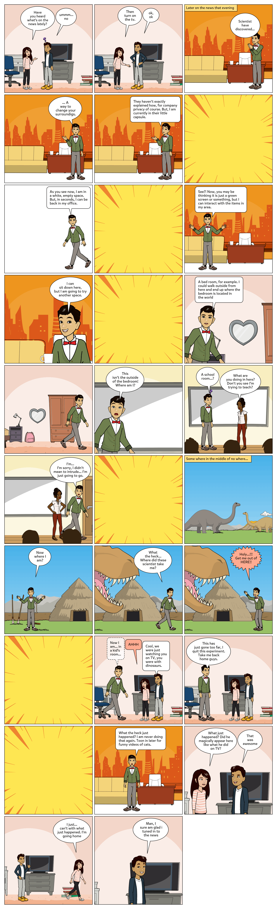
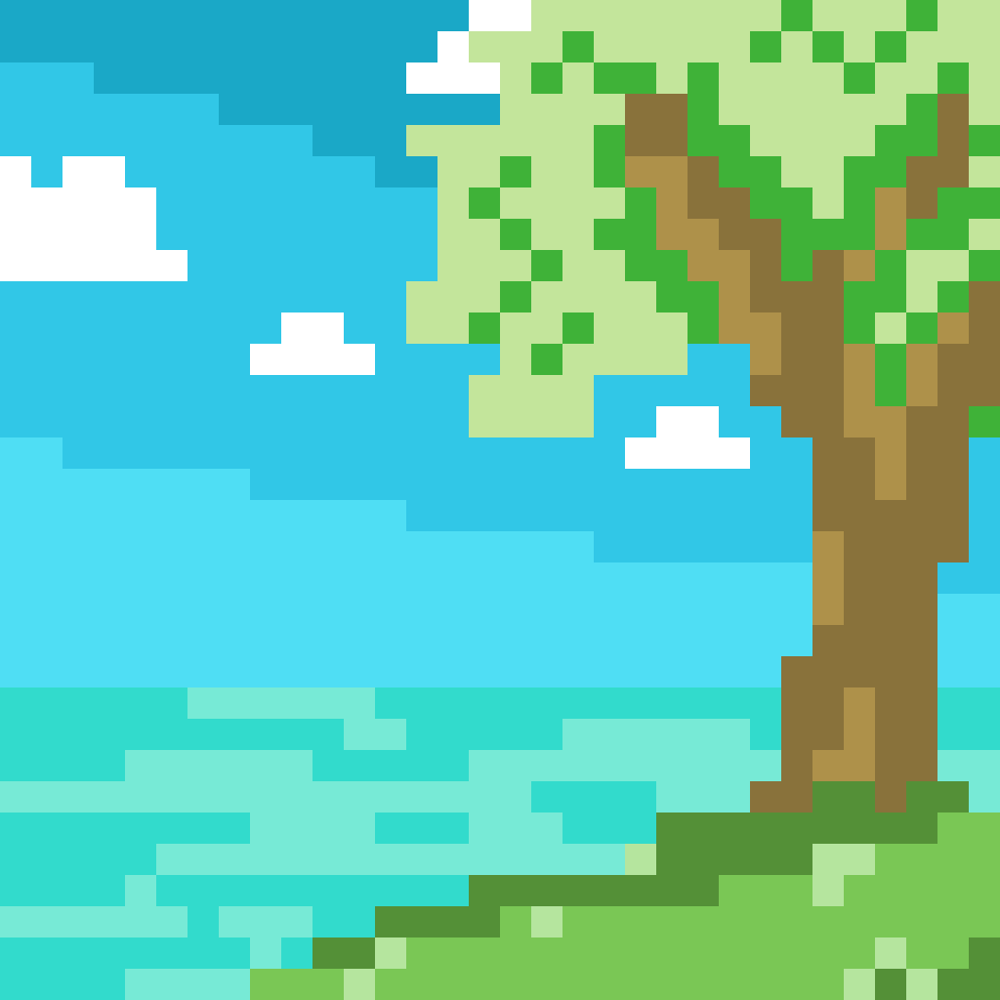

+++
# Gallery section using the Blank widget and Gallery element (shortcode).
widget = "blank"  # See https://sourcethemes.com/academic/docs/page-builder/
headless = false  # This file represents a page section.
active = false # Activate this widget? true/false
weight = 66  # Order that this section will appear.

title = ""
subtitle = ""
+++

## Photography


 
 

## Comics
<table>
  <tr>
    <td style="border: 0;"></td>
    <td style="border: 0;"></td>
    <td style="border: 0;"></td>
    
  </tr>
</table>

 
 

## Animation and GIFs
<table>
  <tr>
    <td style="border: 0;"></td>
    <td style="border: 0;"></td>

    
  </tr>
</table>

 
 

