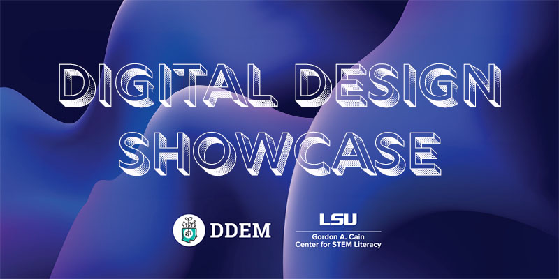

+++

widget = "blank"  # See https://sourcethemes.com/academic/docs/page-builder/
headless = true  # This file represents a page section.
active = true  # Activate this widget? true/false
weight = 2  # Order that this section will appear.

# title = "DDEM Announcements"
# subtitle = "## *A Part of LSU Pathways*"

[design]
  # Choose how many columns the section has. Valid values: 1 or 2.
  columns = "1"

[design.background]
  # Apply a background color, gradient, or image.
  #   Uncomment (by removing `#`) an option to apply it.
  #   Choose a light or dark text color by setting `text_color_light`.
  #   Any HTML color name or Hex value is valid.

  # Background color.
   color = "#0fbaad"
  
  # Background gradient.
   # gradient_start = "#F9F5F4"
   # gradient_end = "#0fbaad"
  
  # Background image.
  # image = "../images/canvas1.png"  # Name of image in `static/img/`.
  # image_darken = 0.6  # Darken the image? Range 0-1 where 0 is transparent and 1 is opaque.
  # image_size = "actual" 
   #  Options are `cover` (default), `contain`, or `actual` size.
  # image_position = "center"  
  # Options include `left`, `center` (default), or `right`.
  # image_parallax = true  # Use a fun parallax-like fixed background effect? true/false
  
  # Text color (true=light or false=dark).
  text_color_light = false

[design.spacing]
  # Customize the section spacing. Order is top, right, bottom, left.
  padding = ["20px", "0", "20px", "0"]

[advanced]
 # Custom CSS. 
 css_style = ""
 
 # CSS class.
 css_class = ""
+++
 

## **2025 Digital Design Showcase** 
 ## Friday, April 11, 2025 8:30 a.m. – 1:30 p.m.     

<a href="../schedule" target="_blank"> <button style= "background-color:#F9F5F4; border: none ; border-radius: 5px; padding: 15px"> Showcase Schedule</button></a> 

 
We are excited to announce the 2025 Digital Design Showcase taking place <b>Friday, April 11, 8:30 a.m. – 1:30 p.m.</b> at the LSU Digital Media Center. This annual event celebrates the creativity, innovation, and hard work of students participating in LSU STEM Pathways programs.    

The Digital Media Center offers a dynamic and professional exhibition environment, fully equipped to highlight a wide range of digital design work. Categories include, but are not limited to:
- Graphic design
- Motion graphics
- Film and video
- Sound design and music
- Video games
- Web design, coding, and programming
- Digital art and sound installations

**Showcase Highlights:**  
🎭 Live student presentations  
🚀 XR studio, immersive audio, & DMC Theatre demos  
🤝 Networking with LSU faculty & industry professionals  

<b> Deadline to confirm attendance is March 28, 2025.  
Deadline to submit student work is April 4, 2025.  </b> 

Please reach out to lsuddem@gmail.com for guidance on how to submit digital files or portfolios for this year’s showcase. Submission instructions will be provided directly to participating schools and teachers.

  

<iframe width="560" height="315" src="https://www.youtube.com/embed/6gmGkra2opY?si=pwe4WK65gG0492j5" title="DDEM Showcase" frameborder="0" allow="accelerometer; autoplay; clipboard-write; encrypted-media; gyroscope; picture-in-picture" allowfullscreen></iframe> 

 