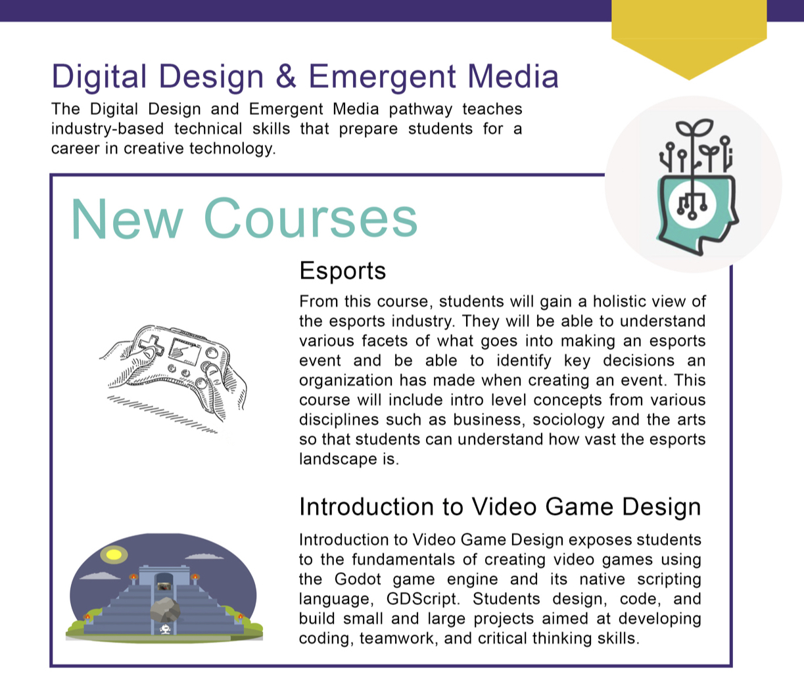

+++

widget = "blank"  # See https://sourcethemes.com/academic/docs/page-builder/
headless = true  # This file represents a page section.
active = true  # Activate this widget? true/false
weight = 6  # Order that this section will appear.

# title = "Links and Flyers"
# subtitle = "## *A Part of LSU Pathways*"

[design]
  # Choose how many columns the section has. Valid values: 1 or 2.
  columns = "1"

[design.background]
  # Apply a background color, gradient, or image.
  #   Uncomment (by removing `#`) an option to apply it.
  #   Choose a light or dark text color by setting `text_color_light`.
  #   Any HTML color name or Hex value is valid.

  # Background color.
   color = "#0fbaad"
  
  # Background gradient.
   # gradient_start = "#F9F5F4"
   # gradient_end = "#0fbaad"
  
  # Background image.
  # image = "../images/canvas1.png"  # Name of image in `static/img/`.
  # image_darken = 0.6  # Darken the image? Range 0-1 where 0 is transparent and 1 is opaque.
  # image_size = "actual" 
   #  Options are `cover` (default), `contain`, or `actual` size.
  # image_position = "center"  
  # Options include `left`, `center` (default), or `right`.
  # image_parallax = true  # Use a fun parallax-like fixed background effect? true/false
  
  # Text color (true=light or false=dark).
  text_color_light = false

[design.spacing]
  # Customize the section spacing. Order is top, right, bottom, left.
  padding = ["20px", "0", "20px", "0"]

[advanced]
 # Custom CSS. 
 css_style = ""
 
 # CSS class.
 css_class = ""
+++

 

# **Links and Flyers** 
 

 

Esports and Introduction to Video Game Design are being offered by the DDEM program in 2024.

 

For more information on the DDEM Pathway and printable flyers:
 
 
<a href="../downloads/DDEMStudents.pdf" target="_blank"> <button style= "background-color:#0fbaad; border: none ; border-radius: 5px; padding: 10px"> DDEM student flyer </button></a> <a href="../downloads/DDEMTeachers.pdf" target="_blank"> <button style= "background-color:#0fbaad; border: none ; border-radius: 5px; padding: 10px"> DDEM teacher flyer </button></a> <a href="../downloads/DDEMAdmin.pdf" target="_blank"> <button style= "background-color:#0fbaad; border: none ; border-radius: 5px; padding: 10px"> DDEM administration flyer </button></a> 
 
 
 
Some of the DDEM classes have accompanying videos introducing the curriculum. 
 
 
<a href="https://lsupathways.org/media-ddem" target="_blank"> <button style= "background-color:#0fbaad; border: none ; border-radius: 5px; padding: 10px"> DDEM curriculum introduction videos </button></a> 
 
 
 
To learn more about LSU STEM Pathways as a whole:
 
 
<a href="https://stempathways.lsu.edu" target="_blank"> <button style= "background-color:#0fbaad; border: none ; border-radius: 5px; padding: 10px"> stempathways.lsu.edu </button></a>

 
 

<!-- Slides from the 2022 DDEM STEM Summit Presentation 
 
"STEM Empowered Students and Agency in the Digital World"
 
 
<a href="https://docs.google.com/presentation/d/1rn8CxmMDH9ltJvo3_nNU8gGRUwm7P-Zqwf1yfJ5PNvs/present#slide=id.p" target="_blank"> <button style= "background-color:#0fbaad; border: none ; border-radius: 5px; padding: 10px"> DDEM STEM Summit Slides</button> </a>
 
 
  -->