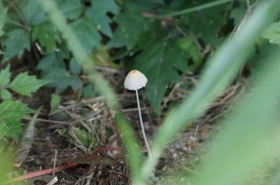
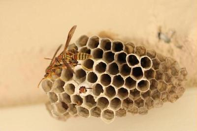
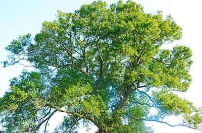
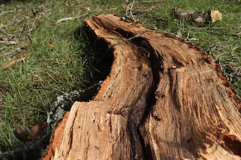
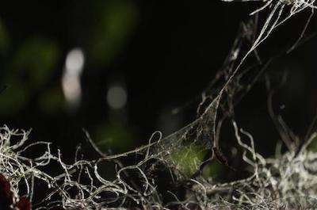
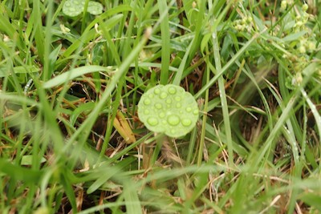

 

# **DDEM Student Work** 
 
<a href="#PDM"> <button style= "background-color:#0fbaad; border: none ; border-radius: 5px; padding: 10px"> Programming Digital Media </button></a> 
<a href="#SoundDesign"> <button style= "background-color:#0fbaad; border: none ; border-radius: 5px; padding: 10px"> Sound Design </button></a> <a href="#DigitalStorytelling"> <button style= "background-color:#0fbaad; border: none ; border-radius: 5px; padding: 10px"> Digital Storytelling </button></a>
 
 

 
<a id = "PDM">
 

## Programming Digital Media

#### Motion Graphics and Interactive Media in p5
 
<iframe style="width: 400px; height: 400px; overflow: hidden;"  scrolling="no" frameborder="0" src="https://editor.p5js.org/LSU-DDEM/full/LirKIYzE_"></iframe>

<iframe style="width: 400px; height: 400px; overflow: hidden;"  scrolling="no" frameborder="0" src="https://editor.p5js.org/LSU-DDEM/full/0256HCqH1"></iframe>

<iframe style="width: 400px; height: 400px; overflow: hidden;"  scrolling="no" frameborder="0" src="https://editor.p5js.org/LSU-DDEM/full/A8THU4sOr"></iframe>

<iframe style="width: 400px; height: 400px; overflow: hidden;"  scrolling="no" frameborder="0"  src="https://editor.p5js.org/LSU-DDEM/full/xDUszLT3k"></iframe>

<iframe style="width: 801px; height: 801px; overflow: hidden;"  scrolling="no" frameborder="0" src="https://editor.p5js.org/LSU-DDEM/full/ZScF_lf7F"></iframe>

<iframe style="width: 800px; height: 800px; overflow: hidden;"  scrolling="no" frameborder="0" src="https://editor.p5js.org/LSU-DDEM/full/rrNloNYCU"></iframe> 
 
</a>
 
<a id = "SoundDesign">
 

## Sound Design

#### Music Composition and Recording Technology
 
<a href="../audio/../../../audio/Audio1.mp3" target="_blank"> <button style= "background-color:#0fbaad; border: none ; border-radius: 5px; padding: 10px"> &#9658; Untitled 1 </button></a> 
 
 
<a href="../audio/../../../audio/Audio2.mp3" target="_blank"><button style= "background-color:#0fbaad; border: none ; border-radius: 5px; padding: 10px"> &#9658; Untitled 2 </button></a> 
 
 
<a href="../audio/../../../audio/Audio3.mp3" target="_blank"><button style= "background-color:#0fbaad; border: none ; border-radius: 5px; padding: 10px"> &#9658; Untitled 3 </button></a> 
 
</a>
 
<a id = "DigitalStorytelling">
 

## Digital Storytelling

#### Photography, Digital Graphics, and Interactive Storytelling

  

  

 

 
</a>

 
 