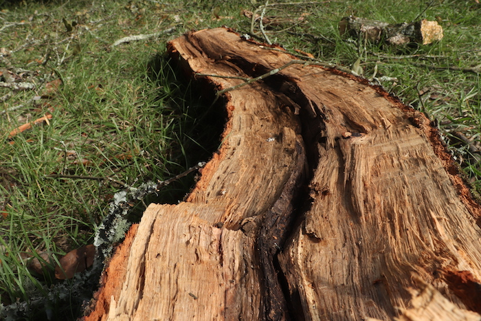

# **DDEM Student Work** 
 

## Programming Digital Media

#### Motion Graphics and Interactive Media in p5

 
<iframe style="width: 400px; height: 400px; overflow: hidden;"  scrolling="no" frameborder="0" src="https://editor.p5js.org/mbardin/embed/_cjez20IT"></iframe>

<iframe style="width: 400px; height: 400px; overflow: hidden;"  scrolling="no" frameborder="0" src="https://editor.p5js.org/mbardin/embed/pCUkOMW55"></iframe>

<iframe style="width: 763px; height: 763px; overflow: hidden;"  scrolling="no" frameborder="0" src="https://editor.p5js.org/mbardin/embed/X18owCD-r"></iframe> 

<iframe style="width: 400px; height: 400px; overflow: hidden;"  scrolling="no" frameborder="0" src="https://preview.p5js.org/mbardin/embed/2TB1Lf6W8"></iframe>

<iframe style="width: 400px; height: 400px; overflow: hidden;"  scrolling="no" frameborder="0"  src="https://preview.p5js.org/maritza.gonzalez/embed/ZtDuYh5Ws"></iframe>

<iframe style="width: 800px; height: 800px; overflow: hidden;"  scrolling="no" frameborder="0" src="https://editor.p5js.org/mbardin/embed/-TOkHhfiO"></iframe>
 
 
 

## Digital Storytelling

#### Photography

 

#### Graphic Novels and Comics

 

#### Music Composition with Found Sounds
 

<a href="../audio/../../../audio/Audio1.mp3" target="_blank">Untitled 1</a>

<a href="../audio/../../../audio/Audio2.mp3" target="_blank">Untitled 2</a>

<a href="../audio/../../../audio/Audio3.mp3" target="_blank">Untitled 3</a>

 
 